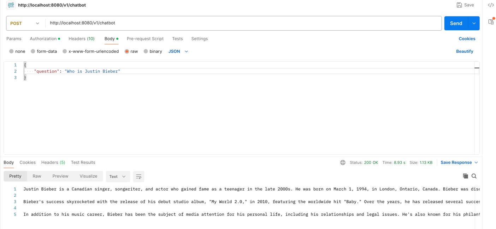

# ai-chatbot-springboot:

An AI chatbot with Spring-boot &amp; MangoDB

# Sample of the API response:

- This project integrates with `gpt-4o-mini` of ChatGPT & generate the sample response for questions as below

# How to obtain API Key:
- Create an account in below portal & generate API Key.
- You will be required to add some credits (5 USD) to start testing the API.
  `https://platform.openai.com/settings/organization/api-keys`
- Put the API key in `application.yml` files.

# Create Mongo Atlas DB instance using free tier:
- Visit the below link & create a free account. 
    `https://www.mongodb.com/cloud/atlas/register`
- Checkout below link to setup Mongo Atlas DB for dev env.
    `https://www.youtube.com/watch?v=bBA9rUdqmgY`
- Put the url of Mongo Atlas DB in `application.yml` file.

@Credits to `https://www.baeldung.com/java-langchain-mongodb` for inspiration & explanation.
